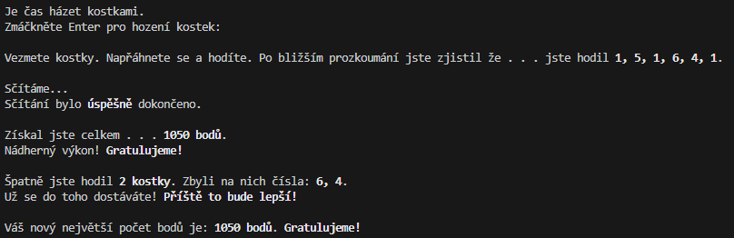
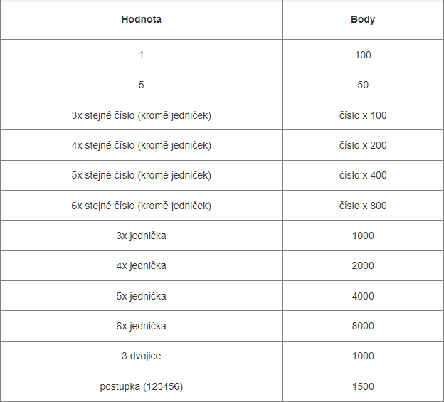

# Kostky
Jak už z názvu vyplívá, jedná se jednoduchou hru o kostkách. Uživatel si může vybrat 2 hrací módy:

* Náhodná generace
* Manuální zadávání <br>

V náhodné generaci za vás kostky hodí počítač a vygeneruje náhodně 6 čísel. <br>
V manuálním zadávání se hra zeptá uživatele, aby zadal 6 čísel podle jeho volby. <br><br>
Následně se sečtou body a pokud budete chtít, můžete rovnou zkoušet vaše štěstí znovu v dalším hodu. <br>

## Další funkce
Kromě sčítání bodů, vám ale program vypíše také:

* Kolik kostek se nevyužilo na bodování a jejich čísla.
* Váš největší dosáhnutý počet bodů.
* Možnost hrát ihned znovu nebo změnit hrací mód po každém vyhodnocování.
* Plus motivační zprávy, k finálnímu počtu bodů a počtu zbylých kostek. <br>

### Screenshot s finálním vyhodnocováním


### Příklad funkce z kódu, co vyhodnocuje trojice, čtveřice, ...
```
# Funkce na kontrolováni počtu stejných čísel
def pocetCisel(gamma, delta, points):       # gamma - jaké číslo hledáme
    global mainPoints                       # delta - kolik jich hledáme
    global hozenaCisla                      # points - body 
    if hozenaCisla.count(gamma) == delta:
        for _ in range(delta):
            hozenaCisla.remove(gamma)
        mainPoints += points
        return True
    else:
        return False
```

### Pravidla, na kterých hra funguje
